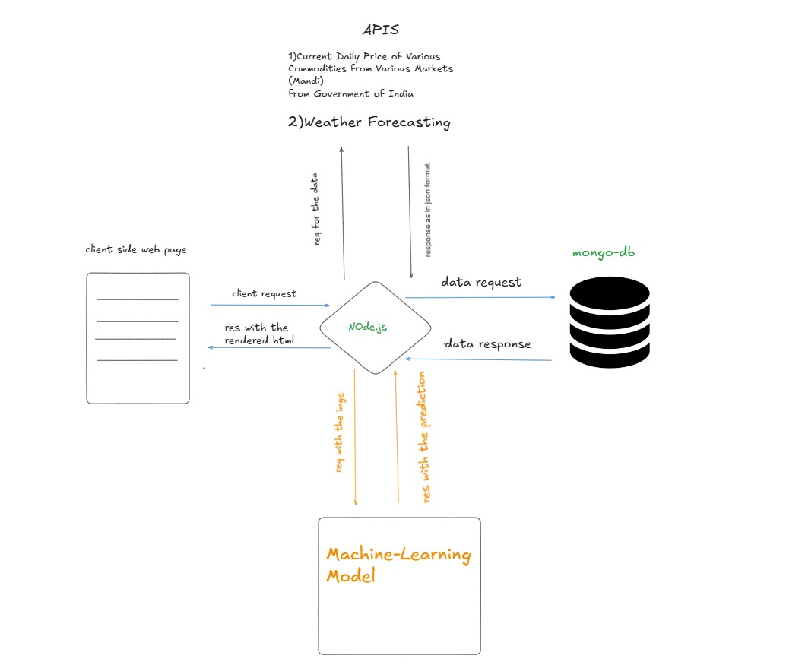

# Smart Farming Assistant (SFA) 🌾

[](./LICENSE)
[](https://nodejs.org/)
[](https://www.mongodb.com/)
[](https://expressjs.com/)

> A comprehensive farming assistance platform that helps farmers make data-driven decisions using AI and real-time data.


<!-- Add your dashboard screenshot here -->

## 🌟 Features

- 🌤️ **Real-time Weather Updates**
  - Location-based weather forecasting
  - Agricultural weather metrics
- 🌱 **Crop Calendar**
  - Personalized planting schedules
  - Region-specific crop recommendations
- 🔍 **Plant Disease Detection**
  - AI-powered image analysis
  - Instant disease identification
  - Treatment recommendations
- 💰 **Market Price Tracking**
  - Real-time crop prices
  - Historical price analysis
  - Market trends

## 🚀 Disease Prediction

[Disease_Detection_api](https://github.com/RepoRange/DISEASE_DETECTON_API)

## 🛠️ Installation

1. **Clone the repository**

```bash
git clone https://github.com/yourusername/smart-farming-assistant.git
cd smart-farming-assistant
```

2. **Install dependencies**

```bash
npm install
```

3. **Configure environment variables**

```bash
cp .env.example .env
# Edit .env with your configuration
```

4. **Start the application**

```bash
npm start
```

## 🔧 Environment Variables

Create a `.env` file with the following:

```env
MONGO_URI=your_mongodb_uri
JWT_SECRET=your_jwt_secret
GOOGLE_CLIENT_ID=your_google_client_id
GOOGLE_CLIENT_SECRET=your_google_client_secret
WEATHER_API_KEY=your_weather_api_key
CROP_PRICE_API=your_crop_api_key
CNN_Model_API = [Disease_Detection_api](https://github.com/RepoRange/DISEASE_DETECTON_API)

```

## 🏗️ Architecture




## 🔌 API Endpoints

### Authentication

- `GET /auth/google` - Google OAuth login
- `POST /auth/logout` - User logout

### Weather

- `GET /api/weather` - Get weather data
- `GET /api/get-weather` - Get detailed forecast

### Crop Management

- `GET /api/crop-calendar` - View crop calendar
- `POST /api/generate-calendar` - Generate planting schedule

### Disease Detection

- `POST /api/upload-endpoint` - Upload plant image
- `GET /api/pest_result` - Get disease analysis

### Market Prices

- `GET /api/crop-prices_form` - View price form
- `GET /api/get-prices` - Get current prices

## 🔒 Security

- JWT-based authentication
- Google OAuth 2.0 integration
- Token blacklisting
- Secure file uploads
- Environment variable protection


## 📄 License

This project is licensed under the MIT License - see the [LICENSE](LICENSE) file for details.

## 🙏 Acknowledgments

- Weather data provided by [WeatherAPI](https://www.weatherapi.com/)
- Crop price data from [data.gov.in](https://data.gov.in/)
- Disease detection model trained using [TensorFlow](https://www.tensorflow.org/)

---

<p align="center">
  Made with ❤️ for Indian Farmers
</p>
